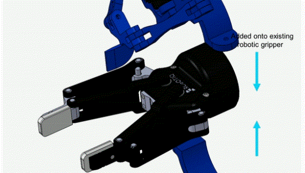

# Extendable Palm Device

## 1. Overview

  

The extendable palm device is a robotic end-effector that can be retrofitted onto existing robotic grippers. It is consturcted as a parallel mechanism that can produce a striaght line motion for the palm while avoiding collisions with the base gripper as can be seen in the videos above. Our 3D-printed prototype is acutated by one Dynamixel AX-12A servo motor connected with a simple gear train. For reproduction of the extendable palm device, please refer to the bill of materials and the link for the Solidworks model made available below.  

**Related Patents**: 
- C. H. Kim and J. Seo, "System and Methods for Robotic Precision Placement and Insertion," US Patent Application, Filed May 11, 2020.

**Related Articles**: 
- C. H. Kim and J. Seo, "Dexterous Ungrasping: Methods and Designs for Secure Placement and Insertion through Dexterous Manipulation," (Under preparation).

**Contributers**: [Chung Hee Kim](https://sites.google.com/view/chjohnkim/home), [Jungwon Seo](http://junseo.people.ust.hk/)

## 2. Bill of Materials

### 3D-Printing Parts

**Solidworks Model**: [Download Link](https://drive.google.com/open?id=1LU2ESZIVc5RaizjKnRRDMieen1sGAB-5)

1. Bracket (Top) x 1
2. Bracket (Bottom) x 1
3. Proximal Link (Left) x 1
4. Proximal Link (Right) x 1
5. Distal Link x 2
6. End-effector Link x 1
7. Gear Connector x 1

### Actuator

- [Dynamixel AX-12A servor motor](http://en.robotis.com/shop_en/item.php?it_id=902-0003-001): Actuator software available [here](http://wiki.ros.org/dynamixel_sdk).

### Gear parts

- Lego Technic Gear, 28 tooth double bevel x 2
- Lego Technic Gear, 20 tooth double bevel x 1

## 3. Maintenance 
For any technical issues, please contact John Kim [chkimaa@connect.ust.hk]().
